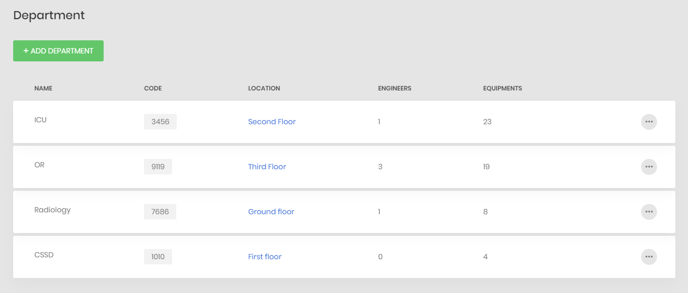

# CMMS
 Computerized Maintenance Management System Project

 # **Reports**
 ## **We have 3 Reports:**

 * ### Installation
 * ### Daily inspection
 * ### PPM

 ## 1. **Installation Report**

 - ### For all the equipment there is an installation report that shows when this device is arrived, installed, warranty period, purchase cost and PM schedule.

 - ### There is some steps you must do it to get your installation report:
 ### 1- press on "*ADD EQUIPMENT* "
       
 ### 2- Here is the Form you must fill it
     
 ### 3- After you fill it, Equipment Card will appear with all equipment information, press here '' (...) ''  to get your Installation Report
      
   

 ## 2. **Daily Inspection Report**

 - ### Daily inspection Report is filled by clinical engineer to ensure the safety of the device and its accessories in each department and check if the device needs maintenance or not.

 - ### There is some steps to fill this report
 ### 1- Sign in as a clinical engineer:
     
 ### 2- Fill the report then press '' Save''
     

 - ### To see your saved report , you must:
 ### 1- press log out
    
 ### 2- Sign in as an Admin
    
 ### 3- Here is our Home, press on " Reports " then " Daily Inspection "
    
 ### 4- Here is your saved report, press " (...) " to show it
    
 ### 5- Final form for Daily Inspection Report of Steam Sterilizer device
    

 ## 3. **PPM (**Planned Preventative Maintenance**) Report**
 - ### For all the equipment, there is a PPM report that is filled with a specific schedule to make sure that the device/accessories need to be maintained or that it is working effectively.

 - ### There is some steps to fill this report
 ### 1- Sign in as a clinical engineer:
     
 ### 2- All reports will appear, choose red " PPM ", a small Form will appear choose the equipment you want to fill it's PPM report then click on blue " PPM ":
    
 ### 3- Here is PPM report for C-Arm 680 OR device, Fill it then press " Save ":
    

 - ### To see your saved report , you must:
 ### 1- press log out
    
 ### 2- Sign in as an Admin
    
 ### 3- Here is our Home, press on " Reports " then " PPM "
    
 ### 4- Here is your saved report, press " (...) " to show it
    
 ### 5- Final form for PPM Report of C-Arm 680 OR device
    

 # **Departments & Equipments**
 ## 1. **Departments**
 - ### We have 4 departments: OR, ICU, Radiology, CSSD.
 - ### Each department has its own information, such as code, location, equipments and engineers who working in it.
     

 - ### Here you can add new departments using "*ADD DEPARTMENT* " button.
    

 - ### Here you can get more information for each department from here.
    

 ## 2. **Equipments**
 - ### There are all equipments of each department.
 - ### Each equipment has its own information, such as name, code, model, serial number, location and the department it's belong to.
    

 - ### Here you can add new equipments using "*ADD EQUIPMENT* " button.
    

 - ### Here you can edit, delete or preview the installation report of each equipment from here.
    

 - ### To see equipment's spare parts, maintenance and break downs, choose "(...)"
    

 ### Then from here they will appear.
   

  * ### Spare Parts:  
    

  * ### Break downs:  
    

  * ### Maintenance:  
    

## Work Orders:
Managing work orders is one of the important features in CMMS systems ,So,we added this feature in our project.
### The admin of the site:
* View all the work orders

    As shown the admin can view many data for each order:

    * Code of the order
    * Start and End date
    * Desciption
    * The Engineer associated with the order
    * The Equipment associated with the order
    * The Cost
    * The Priority of the order marked with colors

 

* Add new orders

    As shown the admin can easily select the engineer and the equipment

* Edit any specific work order

* Delete any specific work order

### The clinical Engineer:
After log in the clinical engineer can view all his work order in a chalender ,the color represent the priority of the order.

## Break Downs:
Recording all the breakdowns happend in your system is very important for decision taking and statistics ,So,in our project the admin can view all the break downs in detials.
### The admin of the site:
* View all the break downs

    As shown the admin can view many data for each order:

    * Code of the break down
    * Reason of the break down
    * The Equipment broken down
    * The Date
    * The Deparment of the equipment

 

* Add new break downs

    As shown the admin can easily select the equipment

* Edit any specific break down

* Delete any specific break down

## Maintenance:
Recording all the maintenance operations in your system is very important for decision taking and statistics ,So,in our project the admin can view all the maintenance operations in detials.
### The admin of the site:
* View all the maintenance operations

    As shown the admin can view many data for each order:

    * Code of the maintenance
    * Start and End Date
    * Description of the maitenance
    * The Equipment assiocated with the maintenance operation
    * the Engineer who made the maintenance operation
    * The Department
    * The break down assiosated with this maintenance

 

* Add new maintenance

    As shown the admin can easily select the equipment and the breakdown

* Edit any specific maintenance

* Delete any specific maintenance
