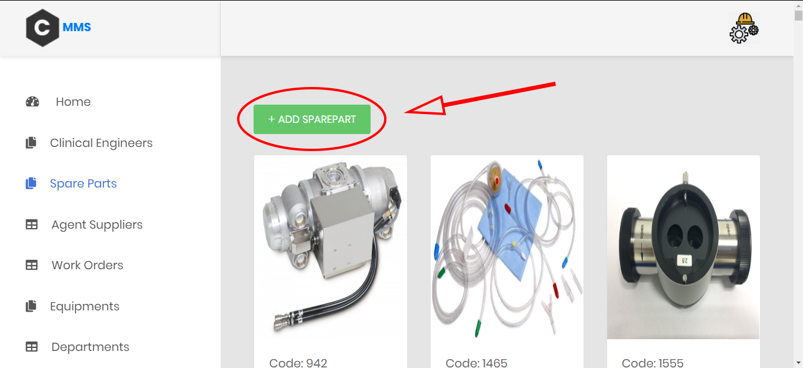

# CMMS
## What is CMMS?
 It stands for Computerized Maintenance Management System. It's a software designed to store the hospital's maintenance data on a computer, whether it's a workorder for a breakdown or a daily inspection. This software simplify the maintenance mangement by giving users insight into the state of maintenance needs with comprehensive work order schedules, accurate inventory of spare parts, and access to very important reports. This information makes it easier for maintenance workers do their jobs more effectively. And CMMS is not only used in medical field, it's used in every industry.

## How to use our software?
 1- First you have to download Node and install it. You can download it from [here](https://nodejs.org/en/)
 2- Second download mysql database and install it, Preferd ampps and you can download it from [here](https://www.ampps.com/downloads)
 3- Open ampps and turn on Apache and MySQl.
 4- from [phpMyAdmin](http://localhost/phpmyadmin/) create new database and name it **cmms**.
 5- Open the folder of the project using your IDE .
 6- Open the terminal of your IDE and write **npm install**, then **nodemon start**.
 7- If it doesn't work you can try **node server.js** or **npm start**.
 8- In your browser open **localhost:3000**.
 9- You will find the home of our website and to see the rest of our website you have to login.
* Note: **email**:admin@gmail.com, **password**:0000

10- Now you can see all the content of our website and edit it.
  
 

## Work Orders:
Managing work orders is one of the important features in CMMS systems ,So,we added this feature in our project.
### The admin of the site:
* View all the work orders
    
    As shown the admin can view many data for each order:
    
    * Code of the order
    * Start and End date
    * Desciption
    * The Engineer associated with the order
    * The Equipment associated with the order
    * The Cost
    * The Priority of the order marked with colors

 

* Add new orders

    As shown the admin can easily select the engineer and the equipment

 

* Edit any specific work order

 

* Delete any specific work order

### The clinical Engineer:
After log in the clinical engineer can view all his work order in a chalender ,the color represent the priority of the order.

 

## Break Downs:
Recording all the breakdowns happend in your system is very important for decision taking and statistics ,So,in our project the admin can view all the break downs in detials.
### The admin of the site:
* View all the break downs
    
    As shown the admin can view many data for each order:
    
    * Code of the break down
    * Reason of the break down
    * The Equipment broken down
    * The Date
    * The Deparment of the equipment 

 

* Add new break downs

    As shown the admin can easily select the equipment

 

* Edit any specific break down

 

* Delete any specific break down

## Maintenance:
Recording all the maintenance operations in your system is very important for decision taking and statistics ,So,in our project the admin can view all the maintenance operations in detials.
### The admin of the site:
* View all the maintenance operations
    
    As shown the admin can view many data for each order:
    
    * Code of the maintenance
    * Start and End Date
    * Description of the maitenance
    * The Equipment assiocated with the maintenance operation
    * the Engineer who made the maintenance operation
    * The Department
    * The break down assiosated with this maintenance

 

* Add new maintenance

    As shown the admin can easily select the equipment and the breakdown

 

* Edit any specific maintenance

 

* Delete any specific maintenance

## Departments
- ### We have 4 departments: OR, ICU, Radiology, CSSD.
- ### Each department has its own information, such as code, location, equipments and engineers who working in it.

    

- ### You can add new departments using (*ADD DEPARTMENT*) button.

   

- ### You can get more information for each department from here.

   

## Equipments
- ### There are all equipments of each department.
- ### Each equipment has its own information, such as name, code, model, serial number, location and the department it's belong to.

   

- ### You can add new equipments using (*ADD EQUIPMENT*) button.

   

- ### You can edit, delete or preview the installation report of each equipment from here.

   

## Spareparts 
### Here we can **Add** any new sparepart entering the Database :

### Here we can see colored arrows which indicate:
* ###  Black Arrow : The **Code** of the Sparepart
* ###  Violet Arrow : The **Name** of the Sparepart
* ###  Blue Arrow : The **Amount or Number** of the Spareparts we have in the inventory
* ###  Green Arrow : The **Equipment Code** which the sparepart belongs to
* ###  Red Arrow : The **Agent ID** which the Equipment and its Spareparts belong to
 

## Agent/Suppliers 
### Here we can **Add** any new agent or supplier we dealed with :

### Here we can see colored arrows which indicate:
* ###  Blue Arrow : The **ID** of the Supplier
* ###  Violet Arrow : The **Name** of the Supplier
* ###  Black Arrow : The **Address** of the Supplier
* ###  Green Arrow : The **Phone Number** of the Supplier
* ###  Red Arrow : The **E-mail or Fax** of the Supplier
 

